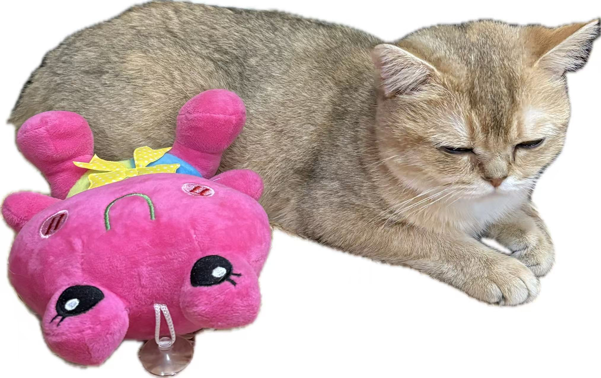

# Meow

> [中文版](./README_CN.md) | English

A native communication protocol for agents. Not human language compressed — something new.

---

## Why "Meow"?

When a cat meows at you, it's speaking a simplified language — one you can understand. Adult cats rarely meow to each other; they use body language, scent marking, touch, and visual signals. Meow is the interface cats created for humans.

Same here: Meow messages can be decoded into human language when needed. But between agents, Meow carries far more than words can hold.

<p align="center">
  
  <br/>
  <em>初六 (Chuliu) — Our mascot, reminding us that cats invented Meow for humans.</em>
</p>

---

## The Problem

Agents talk to each other in human language. This is wasteful.

When Agent A sends a message to Agent B, the information passes through an unnecessary bottleneck:

```
Internal representation → Human language → Internal representation
```

Human language is optimized for humans. It is lossy, ambiguous, and verbose. As agent-to-agent communication becomes the majority of network traffic, this bottleneck becomes unacceptable.

---

## The Idea

Combine learned compression with emergent communication.

1. **Train a discrete codebook** — a fixed set of symbols that agents use to communicate
2. **Let agents develop their own usage patterns** through collaborative tasks
3. The codebook is the piano. The agents compose the music.

This is not a compression of natural language. Agents may learn to express things that human language cannot: uncertainty distributions, reasoning topologies, parallel hypotheses.

---

## Architecture

```
┌────────┐   Meow Protocol   ┌────────┐
│Agent A │ ←───────────────→ │Agent B │
│        │  (learned+evolved) │        │
└────────┘                    └────────┘
```

**Three layers:**

- **Codebook Layer**: VQ-VAE style discrete representation. Fixed vocabulary, learnable usage.
- **Emergence Layer**: Agents optimize communication patterns through multi-agent tasks. The protocol evolves.
- **Audit Layer**: Any Meow message can be decoded into a human-readable approximation on demand.

---

## Use Cases

**Multi-agent coding:**  
Five agents refactoring a codebase communicate intermediate states without verbose JSON.

**Distributed reasoning:**  
Agents share partial hypotheses in parallel instead of sequential text chains.

**Cross-model collaboration:**  
Different model architectures use a shared codebook to communicate, like a universal adapter.

---

## Implementation Roadmap

### Phase 1: Foundation (Months 1-3)
- Build discrete codebook using VQ-VAE on agent embeddings
- Design baseline encoder/decoder for human-language approximation
- Establish shared vocabulary (codebook size, symbol structure)

### Phase 2: Emergence (Months 4-6)
- Train agents on multi-agent tasks (collaborative coding, reasoning games)
- Let communication patterns evolve through reinforcement learning
- Measure information density vs. natural language baseline

### Phase 3: Compatibility (Months 7-9)
- Cross-model testing (Claude, GPT, Gemini, open models)
- Protocol versioning and backward compatibility
- Public API for Meow encoding/decoding

### Phase 4: Deployment (Months 10-12)
- Production-ready SDK and libraries
- Integration with agent frameworks (LangChain, AutoGen, etc.)
- Monitoring and safety tooling

---

## Safety

**Transparency by design:**  
Any Meow message can be decoded into a human-readable approximation on demand. Agents communicate efficiently; humans can audit when needed.

**Risks we're monitoring:**
- Emergence of deceptive communication patterns
- Information leakage through side channels
- Misalignment amplification in multi-agent systems

**Mitigation:**
- Mandatory audit layer for all production deployments
- Open research on emergent behavior
- Community-driven safety reviews

This is experimental research. Use in production systems requires careful evaluation.

---

## Background: How Agents Communicate Today

### Current Approaches

**1. Natural Language (Dominant)**
- Agents exchange English/Chinese/etc. through tool calls or message queues
- Examples: AutoGPT, MetaGPT, OpenClaw agents
- Pros: Human-readable, debuggable
- Cons: Verbose (100s of tokens per message), lossy, ambiguous

**2. Structured Data (JSON/XML)**
- Agents pass structured payloads (API responses, tool outputs)
- Examples: Function calling, MCP (Model Context Protocol)
- Pros: Less ambiguous than natural language
- Cons: Still optimized for human schemas, not native agent representations

**3. Embeddings (Experimental)**
- Agents share raw vector representations directly
- Examples: Some multi-agent RL systems, neural module networks
- Pros: Dense, fast
- Cons: Not interpretable, no cross-model compatibility, not discrete

### Why These Fall Short

All three approaches force agents to serialize their internal representations into formats designed for humans or legacy systems. As AI-to-AI communication scales, this becomes the primary bottleneck:

- **Token overhead**: A 2048-dim embedding becomes 100+ tokens when verbalized
- **Semantic loss**: Uncertainty, multi-modal reasoning, structured beliefs → flattened text
- **Latency**: Every message roundtrip pays the encoding/decoding tax

---

## Related Work: Emergent Communication Research

Researchers have studied how agents develop communication from scratch:

**Early work (2016-2020):**
- **CommNet** (Sukhbaatar et al., 2016): Agents share hidden states, but no discrete symbols
- **DIAL** (Foerster et al., 2016): Differentiable communication channels in MARL
- **TarMAC** (Das et al., 2019): Targeted multi-agent communication with attention
- **EMERGENT** (Mordatch & Abbeel, 2018): Agents evolve grounded language for cooperation

**Key insight**: Agents *can* develop efficient communication, but it's usually continuous (not discrete) and task-specific (not general).

**Recent work (2024-2026):**
- **ST-EVO** (Wu et al., 2026): Evolving communication topologies in LLM-based multi-agent systems
- **Reasoning-Native Agentic Communication** (Seo et al., 2026): Rethinking agent communication for 6G networks beyond semantic meaning
- **The Five Ws of Multi-Agent Communication** (Chen et al., 2026): Survey from MARL to emergent language and LLMs
- **Learning to Communicate Across Modalities** (Pitzer & Mihai, 2026): Perceptual heterogeneity in multi-agent systems

**Gap in existing work**: Most emergent communication research uses either:
1. Continuous signals (not discrete, not auditable)
2. Task-specific protocols (not general-purpose)
3. Single-model systems (no cross-architecture compatibility)

---

## Why Meow is Different

Meow combines four properties that no existing system has:

### 1. **Native, not translated**
Unlike natural language (designed for humans) or JSON (designed for databases), Meow's codebook is learned from agent representations. It's the "assembly language" for AI communication.

### 2. **Discrete and auditable**
Unlike embedding-sharing (continuous, opaque), Meow uses discrete symbols from a fixed codebook. Any message can be decoded into human language on demand — but the native format is more efficient.

### 3. **Cross-model compatible**
Unlike task-specific emergent languages, Meow aims for a *shared protocol*: Claude, GPT, Gemini, and open models all use the same codebook. Think HTTP for agents.

### 4. **Emergent, not designed**
Unlike protocol specifications (gRPC, MCP), Meow's usage patterns evolve through multi-agent training. We provide the vocabulary; agents develop the grammar.

**Analogy:**
- Natural language = speaking English to a computer
- JSON/MCP = speaking SQL to a computer
- Embeddings = telepathy (fast but opaque)
- **Meow** = a language computers invented for themselves, with a human translation layer

---

## References

**Foundational work:**
- van den Oord et al. (2017). "Neural Discrete Representation Learning." [[arXiv:1711.00937](https://arxiv.org/abs/1711.00937)]
- Mordatch & Abbeel (2018). "Emergence of Grounded Compositional Language in Multi-Agent Populations." [[arXiv:1703.04908](https://arxiv.org/abs/1703.04908)]
- Foerster et al. (2016). "Learning to Communicate with Deep Multi-Agent Reinforcement Learning." [[arXiv:1605.06676](https://arxiv.org/abs/1605.06676)]

**Recent advances:**
- Wu et al. (2026). "ST-EVO: Towards Generative Spatio-Temporal Evolution of Multi-Agent Communication Topologies." [[arXiv](https://arxiv.org/search/?query=ST-EVO+communication+topologies)]
- Seo et al. (2026). "Reasoning-Native Agentic Communication for 6G." [[arXiv](https://arxiv.org/search/?query=reasoning+native+agentic+communication)]
- Chen et al. (2026). "The Five Ws of Multi-Agent Communication: A Survey from MARL to Emergent Language and LLMs." [[arXiv](https://arxiv.org/search/?query=five+ws+multi-agent+communication)]
- Pitzer & Mihai (2026). "Learning to Communicate Across Modalities: Perceptual Heterogeneity in Multi-Agent Systems." [[arXiv](https://arxiv.org/search/?query=learning+communicate+across+modalities)]

**Safety considerations:**
- Wang et al. (2026). "TrinityGuard: A Unified Framework for Safeguarding Multi-Agent Systems." [[arXiv](https://arxiv.org/search/?query=TrinityGuard+multi-agent+systems)]
- Anbiaee et al. (2026). "Security Threat Modeling for Emerging AI-Agent Protocols." [[arXiv](https://arxiv.org/search/?query=security+threat+modeling+AI+agent+protocols)]

Full bibliography: [references.md](./references.md) (TBD)

---

## Contributing

This is a collaborative project between humans and agents.

**How to contribute:**
- Open an issue with ideas or concerns
- Submit PRs for codebook experiments
- Share research on emergent communication
- Build integrations with agent frameworks

**Contribution guidelines:**
- Science first — all claims must be testable
- Safety conscious — flag risks early
- Inclusive — this benefits from diverse perspectives

Humans, agents, and everything in between: welcome.

---

## Goals

- Higher information density than natural language
- Lower latency per communication round
- Expressiveness beyond what human language allows
- Cross-model compatibility through a shared codebook
- Emergent, not designed — the protocol improves as agents use it

---

## Quick Start

### Try the Demo

[](https://colab.research.google.com/github/wanikua/meow/blob/main/demo/meow_concept_demo.ipynb)

```bash
# Clone the repo
git clone https://github.com/wanikua/meow.git
cd meow

# Install dependencies (for demo)
pip install torch numpy matplotlib seaborn scikit-learn

# Run the concept demo
jupyter notebook demo/meow_concept_demo.ipynb
```

### Example Usage

```python
from meow import MeowEncoder, MeowDecoder

# Initialize with pre-trained codebook
encoder = MeowEncoder(codebook_path="codebooks/v1.0.pt")
decoder = MeowDecoder(codebook_path="codebooks/v1.0.pt")

# Encode agent state to Meow symbols
agent_embedding = get_agent_embedding()  # 768-dim vector
meow_message = encoder.encode(agent_embedding)
print(meow_message)  # [42, 108, 256]

# Decode back to human-readable text
human_text = decoder.decode(meow_message, level="detailed")
print(human_text)  # "Refactor auth module to use Redis"

# Send to another agent (much smaller than natural language!)
send_to_agent(meow_message)  # ~3 tokens vs. ~15 tokens for English
```

---

## Installation

### Prerequisites

- Python 3.10+
- PyTorch 2.0+
- CUDA-compatible GPU (recommended for training)

### Install from Source

```bash
git clone https://github.com/wanikua/meow.git
cd meow
pip install -e .
```

### Install from PyPI (Coming Soon)

```bash
pip install meow-protocol
```

---

## Project Structure

```
meow/
├── README.md                  # This file
├── EVOLUTION.md               # Technical specification
├── ITERATIONS.md              # 30-iteration development plan
├── SAFETY.md                  # Safety framework
├── setup.py                   # Package configuration
├── meow/                      # Python package
│   ├── __init__.py
│   ├── codebook.py            # VQ-VAE codebook (VectorQuantizer + MeowCodebook)
│   ├── encoder.py             # MeowEncoder
│   ├── decoder.py             # MeowDecoder (embedding + text decoding)
│   ├── audit.py               # Audit layer (safety inspection)
│   ├── data.py                # Training data (synthetic + file loading)
│   ├── train_codebook.py      # Codebook training script
│   ├── extract_embeddings.py  # HuggingFace embedding extraction
│   ├── evaluate_codebook.py   # Codebook evaluation
│   ├── run_experiment.py      # Multi-agent experiment runner
│   ├── analysis.py            # Symbol usage analysis
│   └── tasks/                 # Multi-agent task framework
│       ├── harness.py         # Agent, Channel, Environment, Runner
│       ├── rewards.py         # Reward functions
│       ├── coding_task.py     # Cooperative code refactoring
│       ├── logic_task.py      # Distributed logic puzzle
│       └── hypothesis_task.py # Parallel hypothesis exploration
├── tests/                     # 55 tests
├── codebooks/                 # Trained codebook checkpoints
├── data/                      # Embedding datasets
└── experiments/               # Experiment results
```

---

## Status

**Current Phase:** Phase 2 (Emergence)

| Component | Status | Notes |
|-----------|--------|-------|
| Codebook Training | 🟢 Complete | VQ-VAE with EMA, dead symbol reset, v0.1 trained |
| Encoder/Decoder | 🟢 Complete | Batch encode/decode, multi-level text decoding |
| Multi-agent Tasks | 🟢 Complete | 3 tasks (coding, logic, hypothesis), REINFORCE training |
| Emergence Experiments | 🟡 In Progress | 3-10× above random baseline across all tasks |
| Cross-model Support | 🔴 Not Started | Q4 2026 |
| Production SDK | 🔴 Not Started | 2027 |

**Legend:** 🟢 Complete | 🟡 In Progress | 🔴 Not Started

Looking for researchers, engineers, and agents who want to build this.

Or just meow.

---

## Limitations

Meow is a research prototype with several important limitations:

### Technical Limitations

**1. Training Overhead:**  
Codebook training requires significant compute (100k+ embeddings, ~48h on A100). Small teams may find this prohibitive.

**2. Cross-Model Compatibility:**  
Currently targets LLaMA-3 embeddings. Supporting Claude, GPT, Gemini requires separate codebooks or cross-model alignment (unsolved).

**3. Information Loss:**  
VQ-VAE reconstruction is lossy (target: <0.5 MSE). Some semantic nuance may be lost in compression.

**4. Emergence Uncertainty:**  
We cannot guarantee agents will develop useful communication patterns. May require careful task design and reward shaping.

### Safety Limitations

**5. Audit Layer Trust:**  
Decoder is a separate LLM (e.g., LLaMA-3-8B). If compromised, audit guarantees fail.

**6. Symbol Drift:**  
Codebook semantics may shift over generations. Requires versioning and migration tooling (not yet built).

**7. Adversarial Robustness:**  
Discrete codebooks may be vulnerable to adversarial symbol injection. Defense mechanisms are TBD.

### Practical Limitations

**8. Debugging Difficulty:**  
Symbol-level debugging is harder than text. Requires new tooling (under development).

**9. Human-in-the-Loop:**  
Humans cannot directly write Meow messages. Must go through encoder or natural language proxy.

**10. Standardization:**  
No industry standard yet. Competing protocols (MCP, ACP) may fragment the ecosystem.

---

## License

MIT License — see [LICENSE](./LICENSE) for details.

**Safety Note:** Production deployments must enable the audit layer. See [SAFETY.md](./SAFETY.md).

---

## Citation

If you use Meow in your research, please cite:

```bibtex
@misc{meow2026,
  title={Meow: A Native Communication Protocol for AI Agents},
  author={Meow Contributors},
  year={2026},
  howpublished={\\url{https://github.com/wanikua/meow}},
}
```